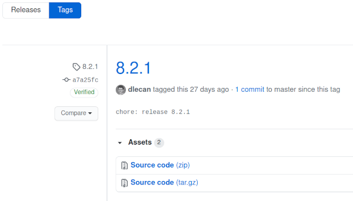
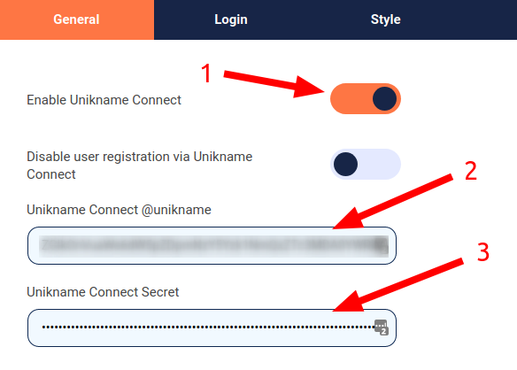
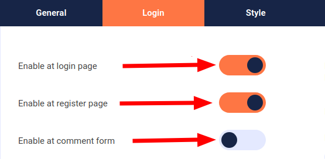

# How to integrate Unikname with WooCommerce?


<hpicture noshadow></hpicture>

<br/>

<brand name="UNC"/> can be easily integrated with your WooCommerce website with a simple plugin. 

[WooCommerce](https://woocommerce.com/) is an open-source e-commerce plugin for WordPress. It's designed for small to large-sized online stores.

[WordPress](https://wordpress.org) is a free and open-source content management system (CMS) written in PHP and paired with a MySQL or MariaDB database.

WordPress is used by more than 60 million websites, it is one of the most popular content management system solutions in use.
WordPress was originally created as a blog-publishing system but has evolved to support other types of web content: corporate website, media galleries, online stores... such as with WooCommerce extension.

:::tip Example
Many WooCommerce websites are running with Unikname Connect such as [La Bande Du Coin](https://www.demo.labandeducoin.fr/) or  [Cryptomaniac](https://www.cryptomaniac.fr) to give you some examples.

👉 You're welcome to look at them and to see how they've integrated the <brand name="UNC"/> Button.
:::

**Table of content**

[[TOC]]

<hseparator/>

:::warning Prerequisites
:heavy_check_mark: You've signed-up for a Unikname-Connect account
<hbox>_See [How to sign-up for a Unikname-Connect account?](./../../howto-signup-unconnect-account)_</hbox>
:heavy_check_mark: You've got and setup the Trust certificate for your website
<hbox>_See [How to get and setup the trust certificate for your website?](./../../howto-get-unikname-trust-certificate-organization)_</hbox>
:heavy_check_mark: During the sign-up process you've received your Unikname-Connect Account ID and your API secret key.

:book: We assume you're familiar with the administration of your WordPress website and you've already installed the WooCommerce plugin on it.
:::

## Step 1. Install the WordPress plugin

Unikname Connect plugin is available **for free** [on the official WordPress plugins repository](https://wordpress.org/plugins/unikname-connect/).

There are various ways of installing the plugin, so choose the one adapted to your installation:

- From your WordPress Dashboard
- With Composer
- From the Github Repository

### Install from your WordPress Dashboard

You can install Unikname Connect directly from your WordPress Dashboard.

1. Go to your WordPress Dashboard
1. Go to the extensions/plugins manager
1. Add a new one
1. Look for `unikname connect` in the search box on right
1. Install `Unikname Connect` plugin
1. Then `enable` it

### Install with Composer

If you're using Composer to manage WordPress, add WordPress-Unikname-Connect to your project's dependencies through the [WordPress Packagist repository](https://wpackagist.org/search?q=unikname+connect).

Run de following command:
```
$ composer require wpackagist-plugin/unikname-connect
```
### Install from the Github Repository

#### Stable version of the plugin

1. Go to [the release page of WordPress-Unikname-Connect plugin](https://github.com/unik-name/wordpress-unikname-connect/releases)
1. Choose the version you want to install by clicking on its version. You should select the last one available
1. Select the archive to download which matches your platform ('zip' or 'tar.gz' - choose 'zip' if you don't know)

<hpicture></hpicture>

1. Extract the downloaded ZIP archive
1. Rename the directory `wordpress-unikname-connect-X.Y.Z` (`X.Y.X` depends on the downloaded version) to `wordpress-unikname-connect`
1. Upload the `wordpress-unikname-connect` directory to your `/wp-content/plugins/` WordPress server directory
1. Activate _Unikname Connect_ plugin from your Plugins page

#### Unstable/development version of the plugin

::: warning ⚠️

With this method, you are going to install a **development** version of the plugin, which **might be unstable**.

Install it only to test unreleased features, to check if a bug as been correctly fixed...

:::

1. Download [WordPress-Unikname-Connect plugin](https://github.com/unik-name/wordpress-unikname-connect/archive/master.zip)
1. Extract the downloaded ZIP archive
1. Rename the directory `wordpress-unikname-connect-master` to `wordpress-unikname-connect`
1. Upload the `wordpress-unikname-connect` directory to your `/wp-content/plugins/` WordPress server directory
1. Activate _Unikname Connect_ plugin from your Plugins page
## Step 2. Setup the WordPress Plugin

### Basic configuration

1. Enable the `Enable Unikname Connect`
1. Configure `Unikname Connect @unikname` with the Unikname-Connect Account ID given from Unikname Team Support
1. Configure `Unikname Connect Secret` with the API Secret Key given from Unikname Team Support

<hpicture></hpicture>

### Pages options

You can then configure on which pages of your WordPress site you want to display the Unikname Connect button:

- WordPress pages

<hpicture></hpicture>

- WooCommerce pages

<hpicture></hpicture>

### Unikname Connect buttons style

You can also fine-tune the style options of the Unikname Connect buttons:

<hpicture></hpicture>

**All done!**

New users are now able to use their @unikname SSID to sign-up to your Wordpress website.

<hseparator/>

## Troubleshooting

See [WordPress troubleshooting section](../wordpress/#troubleshooting).
